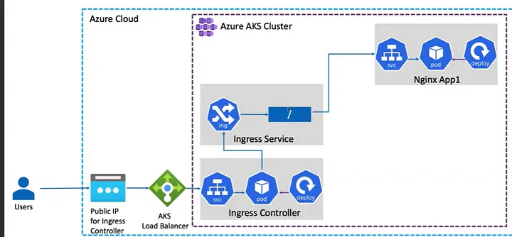

https://medium.com/@anandctx/aks-ingress-load-balancer-how-it-works-e6c5bb6530f7

# 04. Networking <!-- omit in toc -->

# 1. Revisar el Azure Load Balancer
- Frontend IP config
- Backend pools
- Load Balancing Rules (vacío)

# 2. Instalar Ingress Nginx

## 2.1. Instalar Ingress Nginx
```
kubectl apply -f https://raw.githubusercontent.com/kubernetes/ingress-nginx/controller-v1.3.0/deploy/static/provider/cloud/deploy.yaml

kubectl get pods -n ingress-nginx

kubectl get svc -n ingress-nginx
```
> Ingress Controller se encarga de observar los cambios en los Ingress y actualizar la configuración de puertos, paths y dominios.

# 3. Revisar los Frontend IP del balanceador en Azure
> La configuración tiene dos reglas: puerto 80 & 443

# 4. Revisar los Load Balancing Rules
> Reglas de direccionamiento de tráfico a puerto 80 & 443

# 5. Crear un ns
```yaml
apiVersion: v1
kind: Namespace
metadata:
  name: app-demo-lb
```

# 6. Crear un deployment
```yaml
apiVersion: apps/v1
kind: Deployment
metadata:
  name: app-demo-lb
  namespace: app-demo-lb
spec:
  replicas: 3
  selector:
    matchLabels:
      app: app-demo
  template:
    metadata:
      labels:
        app: app-demo
    spec:
      containers:
        - name: nginx
          image: cachac/kubelabs:3.0
          ports:
            - name: tcp
              containerPort: 8080
```

# 7. Exponer los pods con un service ClusterIP
```yaml
apiVersion: v1
kind: Service
metadata:
  name: svc-aks-ingress
  namespace: app-demo-lb
spec:
  ports:
    - port: 80
      targetPort: 8080
      protocol: TCP
  type: ClusterIP
  selector:
    app: app-demo
```

# 8. Revisar recursos
```
kubectl config set-context --current --namespace app-demo-lb

kubectl get pods
kubectl get deploy
kubectl get svc

```
## 8.1. revisar endpoints
```
kubectl describe svc svc-aks-ingress
```

# 9. Crear un Ingress para exponer los contenedores a Internet
```yaml
apiVersion: networking.k8s.io/v1
kind: Ingress
metadata:
  name: ing-aks
  namespace: app-demo-lb
  annotations:
    kubernetes.io/ingress.class: nginx

spec:
  rules:
    - host: <SUBDOMAIN>.kubelabs.dev
      http:
        paths:
          - path: /
            pathType: Prefix
            backend:
              service:
                name: svc-aks-ingress
                port:
                  number: 80
```

## 9.1. validar el ingress
```
kubectl get ingress
kubectl describe ingress
```
> revisar endpoints y address

# 10. Validar el ingress controller (kubernetes Service load balancer)
```
kubectl get service ingress-nginx-controller --namespace=ingress-nginx

```

# 11. Revisar la configuración del Ingress en Azure
- Kubernetes resources - Services and ingresses
  - Ingress-nginx-controller (External IP)

# 12. Diagrama



# 13. Probar en browser

# Info. Configurar AGIC (Application Gateway Ingress Controller)
> [Link](https://learn.microsoft.com/en-us/azure/application-gateway/ingress-controller-install-new)

>[Link](https://www.youtube.com/watch?v=ULXhozeoH0U)

