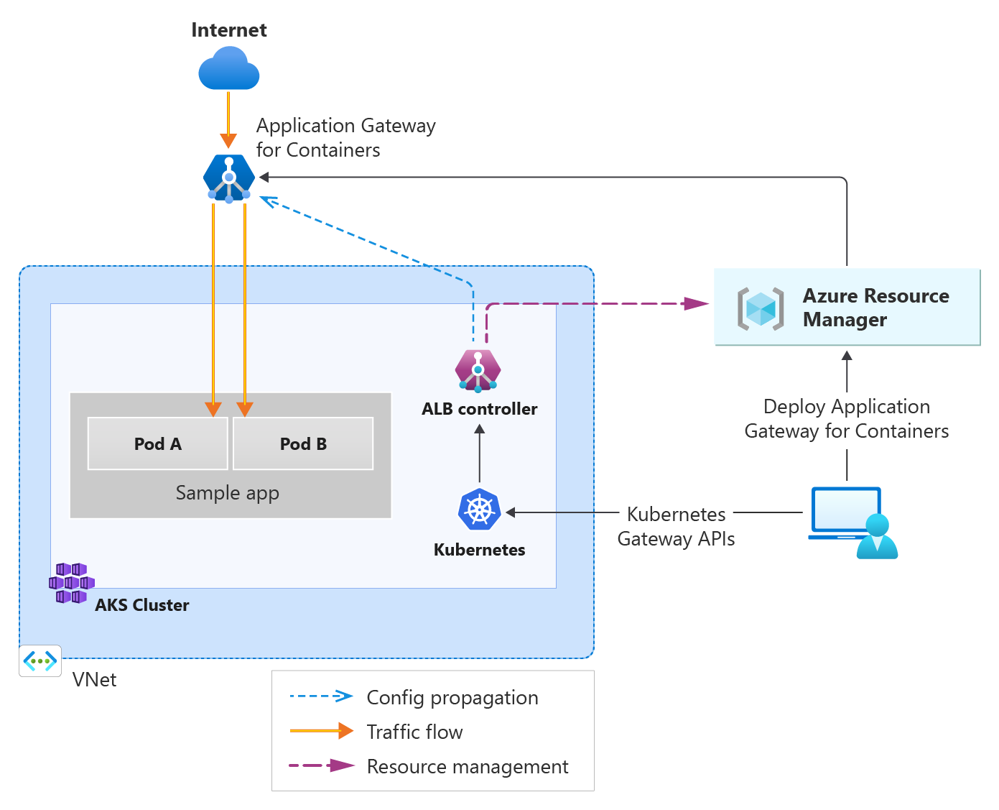

# AGIC for containers  <!-- omit in toc -->
> [Gateway API](https://learn.microsoft.com/en-us/azure/application-gateway/for-containers/overview)

> [Deploy ALB Controller](https://learn.microsoft.com/en-us/azure/application-gateway/for-containers/quickstart-deploy-application-gateway-for-containers-alb-controller?tabs=install-helm-windows)

> [Create managed AGIC for containers AKS](https://learn.microsoft.com/en-us/azure/application-gateway/for-containers/quickstart-create-application-gateway-for-containers-managed-by-alb-controller?tabs=new-subnet-aks-vnet)

> [Traffic splitting](https://learn.microsoft.com/en-us/azure/application-gateway/for-containers/how-to-traffic-splitting-gateway-api?tabs=alb-managed)



# 1. Variables
```sh
AKS_NAME=AGIC-DEMO
RG=RG-agic
REGION=eastus2
VNETNAME=agic-vnet
SUBNETAKS=aks-subnet
SUBNETAPPGW=appgw-subnet
IDENTITY_RESOURCE_NAME=azure-alb-identity
HELM_NAMESPACE=agic-alb
CONTROLLER_NAMESPACE=azure-alb-system
```
## 1.1. Opcional: instalar zsh
```sh
sudo apt install zsh -y
sh -c "$(curl -fsSL https://raw.githubusercontent.com/ohmyzsh/ohmyzsh/master/tools/install.sh)"
chsh -s $(which zsh)
echo "alias k=\"kubectl\"" >> ~/.zshrc
echo "alias ka=\"kubectl apply -f\"" >> ~/.zshrc
echo "alias kg=\"kubectl get\"" >> ~/.zshrc
echo "alias kd=\"kubectl describe\"" >> ~/.zshrc
echo "alias krm=\"kubectl delete -f\"" >> ~/.zshrc
source ~/.zshrc
```

# 2. Crear VNET, subnets y cluster AKS
## 2.1. Eliminar clusters anteriores
## 2.2. Resource group
```sh
az group create --name $RG  --location $REGION
```

## 2.3. VNET
```sh
az network vnet create -g $RG -n $VNETNAME --address-prefix 10.0.0.0/8 \
  --subnet-name $SUBNETAKS --subnet-prefix 10.1.0.0/16
```

## 2.4. Agrega una subnet para AGIC
```sh
az network vnet subnet create -g $RG --vnet-name $VNETNAME -n $SUBNETAPPGW \
  --address-prefix 10.2.0.0/16 \
  --delegations 'Microsoft.ServiceNetworking/trafficControllers'
```

## 2.5. Crea cluster AKS
```sh
az aks create \
  -g $RG \
  -n $AKS_NAME \
  --node-count 1 \
  --node-vm-size Standard_A2_v2 \
  --enable-managed-identity \
  --network-plugin azure \
  --vnet-subnet-id $(az network vnet subnet show -g $RG --vnet-name $VNETNAME -n $SUBNETAKS --query id -o tsv) \
  --enable-oidc-issuer \
  --enable-workload-identity \
  --generate-ssh-key
```
Son importantes los flags --enable-oidc-issuer (identidad OpenID Connect - para autenticar con Azure) y --enable-workload-identity (identidad a nivel de POD)  para que el AGIC funcione correctamente.

### 2.5.1. Opcional, si el cluster ya existe
```sh
az aks update -g $RG -n $AKS_NAME --enable-oidc-issuer --enable-workload-identity --no-wait
```

## 2.6. Revisar recursos en Azure
- Resource group
- VNET
- Subnets
- Cluster AKS

## 2.7. Conectar con el cluster

# 3. Desplegar Application Load Balancer Controller (ALB Controller)
## 3.1. Registrar "resource providers" en azure CLI
```sh
az provider register --namespace Microsoft.ContainerService
az provider register --namespace Microsoft.Network
az provider register --namespace Microsoft.NetworkFunction
az provider register --namespace Microsoft.ServiceNetworking
```

## 3.2. Instalar extension alb
```sh
az extension add --name alb
```

## 3.3. Instalar Helm
```sh
curl https://raw.githubusercontent.com/helm/helm/main/scripts/get-helm-3 | bash
```

## 3.4. Instalar ALB Controller
### 3.4.1. Crea un "managed identity" para el ALB Controller
> ALB controller necesita una credencial llamada exactamente **"azure-alb-identity"**

#### 3.4.1.1. Obten el nombre del grupo de recursos del cluster AKS
```sh
mcResourceGroup=$(az aks show --resource-group $RG --name $AKS_NAME --query "nodeResourceGroup" -o tsv)

mcResourceGroupId=$(az group show --name $mcResourceGroup --query id -otsv)

echo $mcResourceGroup
echo $mcResourceGroupId
```

#### 3.4.1.2. Crea la identidad
```sh
az identity create --resource-group $RG --name $IDENTITY_RESOURCE_NAME
principalId="$(az identity show -g $RG -n $IDENTITY_RESOURCE_NAME --query principalId -otsv)"
echo $principalId
```
> Resultado: "d0d93c21-4bae-431b-984d-a43f4945c1d2"

> Esperar 60 segundos para que la identidad se haga efectiva en Azure.

#### 3.4.1.3. Asigna roles a la identidad
```sh
az role assignment create --assignee-object-id $principalId --assignee-principal-type ServicePrincipal --scope $mcResourceGroupId --role "acdd72a7-3385-48ef-bd42-f606fba81ae7" # Reader role
```
[acdd72a7-3385-48ef-bd42-f606fba81ae7 es el Reader role, Ver](https://learn.microsoft.com/en-us/azure/application-gateway/for-containers/quickstart-deploy-application-gateway-for-containers-alb-controller?tabs=install-helm-linux#install-the-alb-controller)

#### 3.4.1.4. Obten el OIDC issuer
El OIDC issuer es el URL del OpenID Connect issuer del cluster AKS.
```sh
AKS_OIDC_ISSUER="$(az aks show -n "$AKS_NAME" -g "$RG" --query "oidcIssuerProfile.issuerUrl" -o tsv)"

echo $AKS_OIDC_ISSUER
```
#### 3.4.1.5. Crea la credencial federada
Esta credencial es para que el ALB Controller pueda autenticarse con el cluster AKS usando el OIDC issuer (OpenID endpoint).
```sh
az identity federated-credential create --name "azure-alb-identity" \
    --identity-name "$IDENTITY_RESOURCE_NAME" \
    --resource-group $RG \
    --issuer "$AKS_OIDC_ISSUER" \
    --subject "system:serviceaccount:azure-alb-system:alb-controller-sa"
```


### 3.4.2. Instalar ALB Controller con Helm
```sh
kubectl create namespace $HELM_NAMESPACE

helm install alb-controller oci://mcr.microsoft.com/application-lb/charts/alb-controller --namespace $HELM_NAMESPACE --version 1.7.9 --set albController.namespace=$CONTROLLER_NAMESPACE --set albController.podIdentity.clientID=$(az identity show -g $RG -n azure-alb-identity --query clientId -o tsv)
```
Error conocido = json-pointer in "file:///values.schema.json#/properties/definitions/properties/imagePullSecret" not found

[referencia del error](https://github.com/azure/aks/issues/5236)

Solución: --skip-schema-validation

> Resultado: Congratulations! The ALB Controller has been installed in your Kubernetes cluster!

## 3.5. Revisar los pods del ALB Controller
```sh
kubectl get pods -n azure-alb-system
kubectl get gatewayclass azure-alb-external -o yaml
```
GatewayClass: es el tipo de controlador o configuración default.

> Resultado:
```yaml
spec:
  controllerName: alb.networking.azure.io/alb-controller
status:
  conditions:
  - lastTransitionTime: "2025-10-08T18:23:34Z"
    message: Valid GatewayClass
    observedGeneration: 1
    reason: Accepted
    status: "True"
    type: Accepted
```

### 3.5.1. Revisar logs del ALB Controller
Abrir el log en otra ventana y mantenerla abierta para ver los eventos del ALB Controller.
```sh
kubectl logs -f -n azure-alb-system deploy/alb-controller
```
Resultado:
```
Processing requested object kube-system/sh.helm.release.v1.aks-managed-overlay-upgrade-data.v32
Successfully processed object kube-system/sh.helm.release.v1.aks-managed-overlay-upgrade-data.v32
```

# 4. Aprovisionar el AGIC for Containers
## 4.1. Revisar los ID de las subnets
Subnet del cluster y subnet para AGIC
```sh
MC_RESOURCE_GROUP=$(az aks show --name $AKS_NAME --resource-group $RG --query "nodeResourceGroup" -o tsv)

echo $MC_RESOURCE_GROUP

CLUSTER_SUBNET_ID=$(az vmss list --resource-group $MC_RESOURCE_GROUP --query '[0].virtualMachineProfile.networkProfile.networkInterfaceConfigurations[0].ipConfigurations[0].subnet.id' -o tsv)
read -d '' VNET_NAME VNET_RESOURCE_GROUP VNET_ID <<< $(az network vnet show --ids $CLUSTER_SUBNET_ID --query '[name, resourceGroup, id]' -o tsv)

ALB_SUBNET_ID=$(az network vnet subnet show --name $SUBNETAPPGW --resource-group $RG --vnet-name $VNET_NAME --query '[id]' --output tsv)

echo $CLUSTER_SUBNET_ID
echo $ALB_SUBNET_ID
```

## 4.2. Delegar permisos al managed identity
### 4.2.1. Delega el rol "AppGw for Containers Configuration Manager" al AKS Managed Cluster RG
Este rol le permite al ALB Controller crear y gestionar el AGIC for containers.
```sh
echo $IDENTITY_RESOURCE_NAME

mcResourceGroupId=$(az group show --name $MC_RESOURCE_GROUP --query id -otsv)
principalId=$(az identity show -g $RG -n $IDENTITY_RESOURCE_NAME --query principalId -otsv)

echo $mcResourceGroupId
echo $principalId

az role assignment create --assignee-object-id $principalId --assignee-principal-type ServicePrincipal --scope $mcResourceGroupId --role "AppGw for Containers Configuration Manager"
```

### 4.2.2. Delega el persmiso de "Network Contributor" para unirse a la subnet asociada al cluster
Este rol le permite al ALB Controller unirse a la subnet creada ($SUBNETAPPGW).
```sh
az role assignment create --assignee-object-id $principalId --assignee-principal-type ServicePrincipal --scope $ALB_SUBNET_ID --role "Network Contributor"
```

### 4.2.3. En Azure, revisar la subnet de AGIC
- Click a la subnet
- Subnet Delegation
  - Microsoft.ServiceNetworking/trafficControllers

#### 4.2.3.1. Opcional: en caso de no existir la delegación
```sh
az network vnet subnet update \
  --resource-group $RG \
  --vnet-name $VNETNAME \
  --name $SUBNETAPPGW \
  --delegations Microsoft.ServiceNetworking/trafficControllers
```

> En este punto aun no se crea el AGIC for containers.

## 4.3. Crear los recursos de Kubernetes
```yaml
apiVersion: v1
kind: Namespace
metadata:
  name: alb-test-infra
```

## 4.4. Crear ApplicationLoadBalancer. Sustituir el alb subnet id
Este recurso actúa como la representación en Kubernetes del load balancer de Capa 7 (L7) en la nube, y es la pieza central que inicia la provisión de toda la infraestructura AGIC.

```sh
echo $ALB_SUBNET_ID
```

```yaml
apiVersion: alb.networking.azure.io/v1
kind: ApplicationLoadBalancer
metadata:
  name: alb-test
  namespace: alb-test-infra
spec:
  associations:
  - $ALB_SUBNET_ID ------ SUSTITUIR
```

```sh
kubectl get applicationloadbalancer alb-test -n alb-test-infra -o yaml
```

Resultado:
```yaml
reason: Accepted
status: "True"
type: Accepted
```

kubectl get applicationloadbalancer alb-test -n alb-test-infra -w

Resultado:
```sh
NAME       DEPLOYMENT   AGE
alb-test   True         12m
```

Espera unos minutos hasta que el DEPLOYMENT muestre "True"


### 4.4.1. En caso de no tener el DEPLOYMENT TRUE
Revisar el log del ALB Controller.

#### 4.4.1.1. Errores conocidos
1. The client '04ba5099-5857-4dd2-bc88-995a7a64b2b2'(azure-alb-identity) has no configured federated identity credentials

Solución:
Se deben asignar los permisos al client ID del ALB Controller.
```sh
az identity federated-credential create --name "azure-alb-identity" \
    --identity-name "$IDENTITY_RESOURCE_NAME" \
    --resource-group $RG \
    --issuer "$AKS_OIDC_ISSUER" \
    --subject "system:serviceaccount:azure-alb-system:alb-controller-sa"

```

2. The client 'a57f044e-714c-40a0-8e91-079f10ffacaa' with object id 'a57f044e-714c-40a0-8e91-079f10ffacaa' does not have authorization to perform action

Solución:
```sh
CLIENT_ID=$(az identity show -g $RG -n $IDENTITY_RESOURCE_NAME --query clientId -otsv)
# Validar que el $CLIENT_ID sea el mismo que en el error.
echo $CLIENT_ID
az role assignment create --assignee-object-id $CLIENT_ID --assignee-principal-type ServicePrincipal --scope $mcResourceGroupId --role "AppGw for Containers Configuration Manager"
```

Si el error continua después de varios minutos se puede reiniciar el ALB Controller
```sh
kubectl rollout restart deployment alb-controller -n azure-alb-system

# También se puede considerar recrear el ALB
kubectl delete -f alb.yaml
kubectl apply -f alb.yaml
```

Resultado esperado:
```
message":"Deploying Application Gateway for Containers resource: alb-test-infra/alb-test"

alb-test   True         18m
```

## 4.5. En Azure, revisar Application Gateways
Si no se ha creado darle unos minutos y volver a revisar.

- Associations: asociado al subnet.
- Frontends: aun no tiene.


# 5. Crear el Gateway
## 5.1. Ejecutar un deployment de pruebas
```sh
kubectl apply -f https://raw.githubusercontent.com/MicrosoftDocs/azure-docs/refs/heads/main/articles/application-gateway/for-containers/examples/traffic-split-scenario/deployment.yaml
```
## 5.2. Revisar los services y pods
```sh
kubectl get svc,pods -n test-infra
```
service/backend1 = puerto 8080
service/backend2 = puerto 8080


## 5.3. Crear el gateway
```yaml
apiVersion: gateway.networking.k8s.io/v1
kind: Gateway
metadata:
  name: gateway-01
  namespace: test-infra
  annotations:
    alb.networking.azure.io/alb-namespace: alb-test-infra
    alb.networking.azure.io/alb-name: alb-test
spec:
  gatewayClassName: azure-alb-external
  listeners:
  - name: http
    port: 80
    protocol: HTTP
    allowedRoutes:
      namespaces:
        from: Same
```

```sh
kubectl get gateway gateway-01 -n test-infra -o yaml
```

Resultado:
```yaml
status:
  addresses:
  - type: Hostname
    value: czatbqe5ajckfgdj.fz87.alb.azure.com
message: Valid Gateway
    observedGeneration: 1
    reason: Accepted
    status: "True"
    type: Accepted
message: Application Gateway for Containers resource has been successfully updated.
```

### 5.3.1. Error conocido: el ALB controller no está listo
```yaml
    message: Waiting for controller
```

Solución:
  revisar el alb
```sh
kubectl get applicationloadbalancer alb-test -n alb-test-infra -oyaml
```
- El ALB está en proceso de actualización, debe esperar unos minutos.
```yaml
       message: Application Gateway for Containers resource alb-37f4e9d7 is undergoing an update.
       reason: InProgress
```

- Cualquier otro error debe estar relacionado con permisos. Se debe verificarel log del ALB Controller y eliminar el gateway hasta que el ALB DEPLOYMENT = TRUE


## 5.4. Crea el HTTP Route
Administra el tráfico, en este ejemplo se distribuye el tráfico entre dos servicios (70-30).
```yaml
apiVersion: gateway.networking.k8s.io/v1
kind: HTTPRoute
metadata:
  name: traffic-split-route
  namespace: test-infra
spec:
  parentRefs:
  - name: gateway-01
  hostnames:
  - "TEST.kubelabs.dev"
  rules:
  - backendRefs:
    - name: backend-v1
      port: 8080 # puerto del service
      weight: 70
    - name: backend-v2
      port: 8080 # puerto del service
      weight: 30
```

```sh
kubectl get httproutes -n test-infra
kubectl get httproutes -n test-infra -oyaml
```

Resultado:
```yaml
    - lastTransitionTime: "2025-10-08T15:39:17Z"
      message: Route is Accepted
      observedGeneration: 1
      reason: Accepted
      status: "True"
      type: Accepted

			message: Application Gateway for Containers resource has been successfully updated.
```

## 5.5. Revisar los App Gateway Frontend
Ya tiene un FQDN

## 5.6. Probar el acceso
El 70% de los requests van al backend1 y el 30% al backend2
```sh
kubectl get gateway gateway-01 -n test-infra -o jsonpath='{.status.addresses[0].value}'

# Probar, ejemplo:
curl -i -H "Host: carlos.kubelabs.dev" czatbqe5ajckfgdj.fz87.alb.azure.com
```

### 5.6.1. Probar en Browser (http)
Debe agregar el CNAME al DNS de su proveedor.

Para pruebas locales puede buscar la IP del FQDN del gateway (ping) y agregarla al /etc/hosts


# Eliminar recursos
```sh
# aks
az aks delete --name $AKS_NAME --resource-group $RG

# azure resource group
az group delete --name $RG
```


